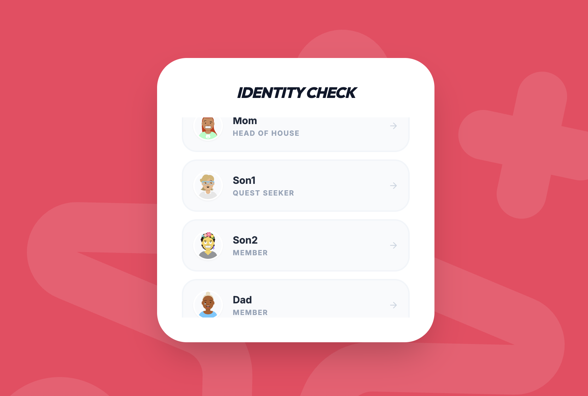
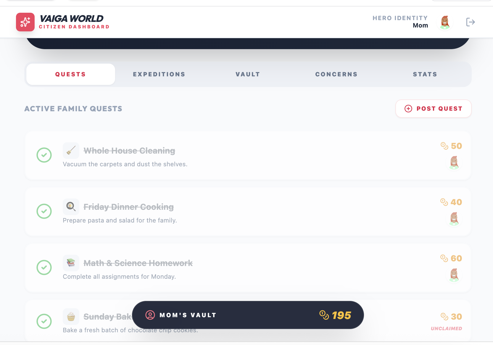
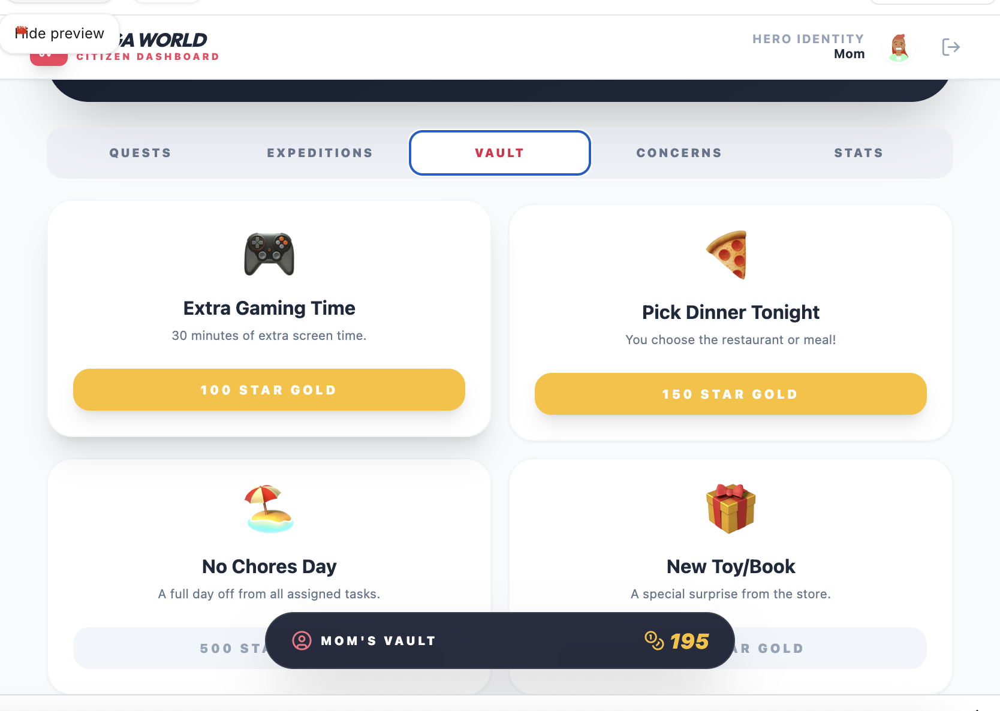
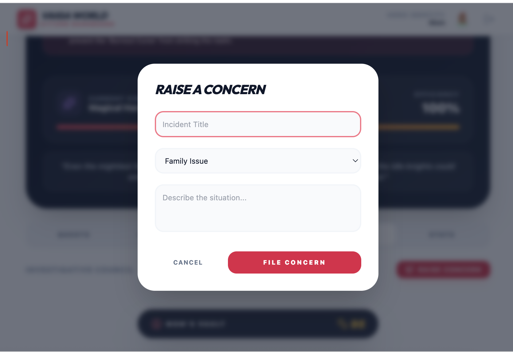
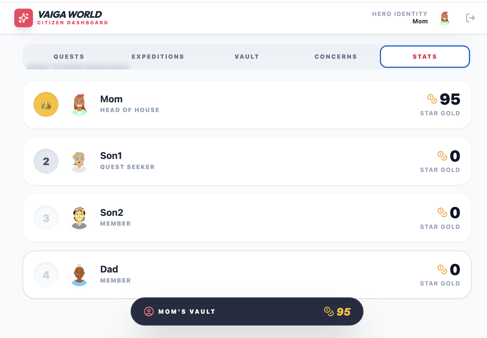

# 📱 Family App  
A modern, gamified family‑management application built with **Vite + TypeScript + React**, enhanced with **Google Gemini AI**.  
This project transforms everyday family responsibilities into engaging, trackable quests that motivate participation and build positive habits.

---

## 🌟 What This App Is About 

HuddleHome takes the chaos of family life and turns it into something way more fun than a boring chore chart. Think of it as your family’s quest board — where everyday tasks become mini‑missions, rewards are real (hello, coins!), and everyone gets to feel like a hero.

Instead of nagging or guessing who did what, each task becomes a quest with its own description, reward value, and status. Family members hop in, see what needs doing, complete quests, and watch their coin stash grow. Finished tasks get a satisfying “done!” glow, and progress is super easy to follow.

## HuddleHome Helps Families
⚡ Team up like a squad on a mission.

⚡ Build independence without the drama.

⚡ Turn everyday chores into fun, gamified challenges.

⚡ See clearly who’s actually doing the work.

⚡ Get kids and adults equally in the game.

⚡ Keep the household organized… and make it fun. 

In short:  
**It’s a gamified family engagement platform that turns everyday responsibilities into fun, trackable quests.**

---

## 😂 A Little Family-App Humor  
**“Finally, a way to get chores done without negotiating like you're at a hostage situation.”**

---

## 🎨 Project Logo  -Huddle Home "Huddle. Help. Home.”


---

## 📸 Screenshots  


### Dashboard - Family Quests Where chores transform into heroic missions… and procrastination meets its final boss.





### Quest - Because every legendary warrior deserves to know how many coins they’ll earn for doing the dishes.




### Vault - Welcome to the family bank — powered by chores, fueled by snacks, audited by Mom.





### Raise Concern - For those moments when the real quest is surviving family drama with dignity





### Stats - Finally, a leaderboard where everyone can see who’s actually pulling their weight.




---

## 🚀 Features  
- ⚡ Fast, modern development with **Vite + TypeScript**  
- 🤖 **Gemini API integration** for AI‑powered interactions  
- 🧩 Modular, reusable **React components**  
- 🎮 Gamified UI for family tasks and rewards  
- 📁 Clean, scalable project structure  
- 🌐 Ready for deployment to Google AI Studio or any static hosting provider  

---

## 🖥️ Dashboard Overview  

The main dashboard displays:

- **Active Family Quests**
  
- Families can see all active quests, along with their descriptions, rewards, and completion status. 
- A dedicated Vault shows how many coins each user has earned, while easy‑to‑navigate tabs—Quests, Expeditions, Vault, Concerns, and Stats—keep the experience organized 
- Navigation tabs for Quests, Expeditions, Vault, Concerns, and Stats
  

This creates a simple, intuitive experience for families to manage responsibilities together.

---

## 🗂️ Project Structure  

```
Family-App/
│
├── components/          # UI components
├── App.tsx              # Root application component
├── constants.tsx        # App-wide constants
├── geminiService.ts     # Gemini API integration logic
├── index.html           # App entry HTML
├── index.tsx            # React entry point
├── metadata.json        # AI Studio metadata
├── package.json         # Dependencies & scripts
├── tsconfig.json        # TypeScript configuration
└── vite.config.ts       # Vite configuration
```

---

## 🛠️ Getting Started

### **Prerequisites**
- Node.js (LTS recommended)  
- A Gemini API Key from Google AI Studio  

---

## 🔧 Installation & Setup

### 1. Clone the repository
```bash
git clone https://github.com/mayababuji/Family-App.git
cd Family-App
```

### 2. Install dependencies
```bash
npm install
```

### 3. Add your Gemini API key  
Create a `.env.local` file:

```
GEMINI_API_KEY=your_api_key_here
```

### 4. Start the development server
```bash
npm run dev
```

App runs at:

```
http://localhost:5173
```

---

## 🤖 Gemini API Usage  
`geminiService.ts` handles:

- API initialization  
- Request/response handling  
- Error management  
- Reusable helper functions  

This keeps AI logic clean and easy to extend.

---

## 📦 Build for Production
```bash
npm run build
```

Output is generated in the `dist/` folder.

---

## 🌐 Deployment  
Compatible with:

- Google AI Studio  
- Netlify  
- Vercel  
- GitHub Pages  
- Any static hosting provider  

---

## 📄 Metadata  
`metadata.json` is used by Google AI Studio to configure app behavior and deployment settings.

---

## 🤝 Contributing  
Pull requests are welcome.  
For major changes, please open an issue first to discuss the proposed update.

---

## 📜 License  
No license is currently specified.  
If you plan to make the project public, consider adding one (MIT, Apache 2.0, etc.).

